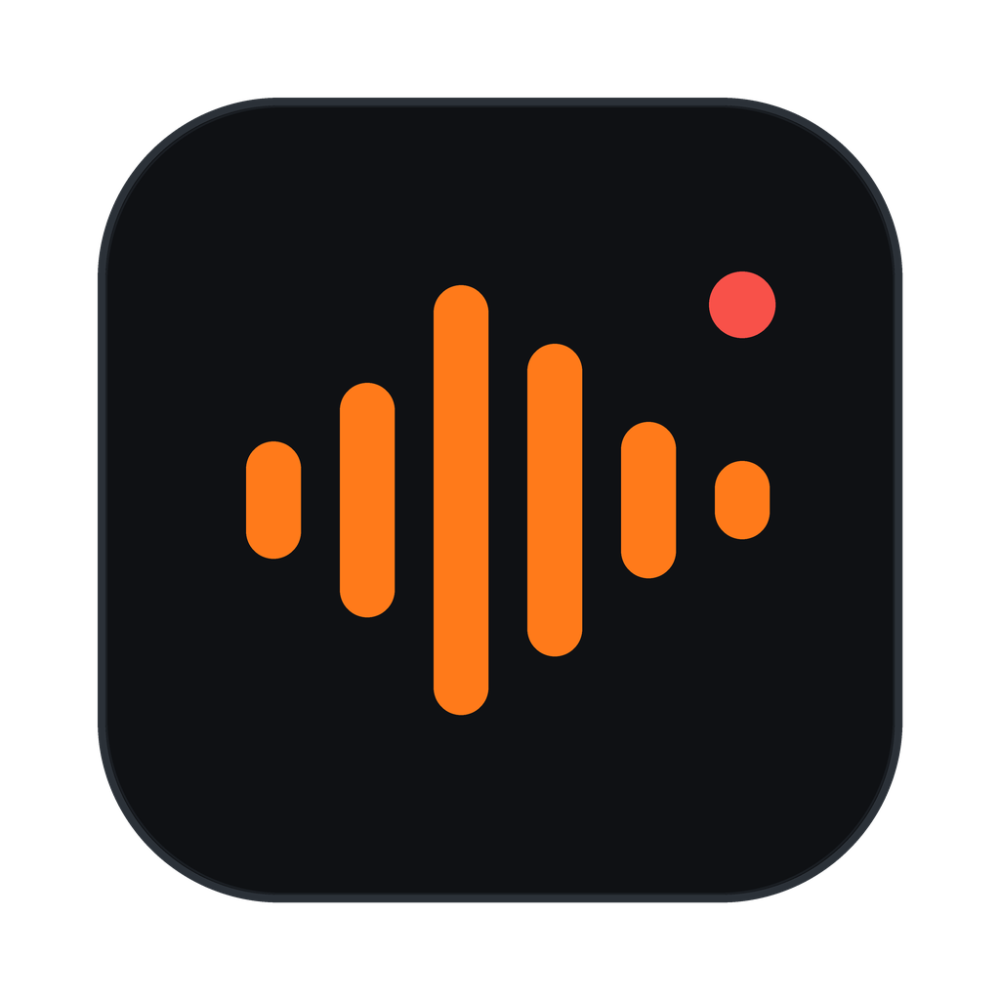

<p align="center">
  
</p>

<h1 align="center">waver</h1>

<p align="center">
  A non-destructive audio recorder and multitrack clip editor.<br />
  Rust audio engine, hardware-inspired interface, clean capture first.
</p>

<p align="center">
  
  
  
  
  
  
  
</p>

---

Waver records, arranges, and mixes audio without ever touching your source files.
Every cut, trim, fade, and gain change is metadata over immutable recordings, so any
edit can be undone at any time. The motivating constraint is fidelity on capture:
the input path applies zero DSP (no AGC, no noise suppression, no implicit
resampling), which is why this is a native app rather than a browser PWA.

## Features

### Recording

- Low-latency capture through cpal with device, sample rate, and buffer selection,
  persisted between sessions
- Live waveform on the armed track while recording; the view follows the write head
- Track arming with a tri-state toggle; takes land at the playhead and never
  overwrite existing clips
- Peak-programme input metering (instant attack, timed release, clip latch, dB
  scale) plus a mini meter in the armed track header
- Crash recovery: unsaved work autosaves to app data and is offered for restore
  after an unclean exit

### Editing

- Non-destructive clips: move, trim, split, duplicate, copy and paste, ripple delete
- Multi-select with group drag, one-step group delete, and merge (consolidate) that
  bakes clip gains and fades into a new source
- Persistent clip groups and clip locking, enforced in the engine rather than the UI
- Time-range selection across all tracks: loop it, delete it (with or without
  ripple), zoom to it, or export exactly that span
- Fades with four curve shapes (linear, equal power, log, S-curve), draggable
  corner handles, live length readout, and right-click presets
- Splits and trims snap to source zero crossings for click-free cuts (toggleable)
- Named markers: drop them at the playhead, drag them on the ruler, snap edits to
  them; they save with the project
- Magnetic snapping to grid, clip edges, markers, and the playhead; hold Ctrl or
  Alt mid-drag to bypass
- Per-clip and per-track gain, normalize to -1 dBFS, mute, solo, per-track color
- Undo and redo across every operation; no-op edits are filtered and project
  invariants are validated at a single commit point

### Playback

- Sample-accurate transport with click-to-seek, scrubbing, keyboard seeking, and a
  start-point playhead so play returns to where you began
- Loop regions edited directly on the ruler: drag the band to move it, its tabs to
  resize it, live during playback
- Playback speed from 0.5x to 2x in two modes: tape-style repitch or
  pitch-preserving stretch (WSOLA, implemented in the engine, dependency-free)
- Stereo master output metering with clip latch, computed lock-free in the output
  callback

### Files

- Project files are plain JSON referencing immutable sources; saves are atomic
- Import WAV, FLAC, MP3, OGG, AAC, and AIFF; a media pool holds sources for
  audition and drag placement
- Export the mixdown or the current selection to WAV, FLAC, MP3 (LAME), OGG
  (Vorbis), or Opus
- Recent-projects menu, dirty-state tracking, and close guards against losing work

### Interface

- Monospaced graphite-and-orange design language inspired by hardware recorders;
  light and dark themes driven entirely by CSS design tokens, including the canvas
- Canvas timeline with adaptive grids, per-channel waveforms, and DPI-aware
  rendering
- Resizable panels (media pool, track controls, time ruler) with double-click and
  menu reset
- Right-click context menus on clips, lanes, the ruler, fades, markers, and track
  headers
- Built-in keyboard cheat-sheet (press ?) and quick-start guide
- Fast custom tooltips, focus-trapped dialogs, ARIA labelling, and WCAG-checked
  contrast and hit targets

## Keyboard reference

| Key                 | Action                                                         |
| ------------------- | -------------------------------------------------------------- |
| Space               | Play or pause; stops a rolling take                            |
| Shift+R             | Start or stop recording                                        |
| R                   | Arm the selected clip's track                                  |
| S                   | Split at the playhead                                          |
| M                   | Drop a marker at the playhead                                  |
| Cmd+C / X / V / D   | Copy, cut, paste, duplicate                                    |
| Cmd+J               | Merge the selected clips                                       |
| Cmd+G / Shift+Cmd+G | Group or ungroup clips                                         |
| Cmd+L               | Lock or unlock clips                                           |
| Cmd+S / Shift+Cmd+S | Save, Save As                                                  |
| Cmd+Z / Shift+Cmd+Z | Undo, redo                                                     |
| Arrow keys          | Nudge the selected clip, or seek the playhead                  |
| Home / End          | Jump to start or end                                           |
| F / E / T / N       | Fit to window, zoom to selection, fold all tracks, toggle snap |
| + / -               | Zoom at the playhead                                           |
| Esc                 | Stop playback, then clear the range, then the selection        |
| ?                   | Keyboard cheat-sheet                                           |

Drag across empty lane space to select a time range. Drag the ruler vertically to
zoom and horizontally to scrub. Shift-click clips to multi-select.

## Building from source

Prerequisites: [Rust](https://rustup.rs) (stable, pinned via `rust-toolchain.toml`),
[Node.js](https://nodejs.org) 20+, and the
[Tauri v2 system dependencies](https://v2.tauri.app/start/prerequisites/) for your
platform.

```sh
npm install
npm run tauri dev      # development build with hot reload
npm run tauri build    # release bundle (macOS .app / .dmg)
```

macOS note: microphone permission is granted per binary. Development builds are
unsigned, so use the bundled app from `npm run tauri build` when testing capture.

## Testing and linting

```sh
cargo test --workspace              # engine and model tests, incl. DSP regressions
cargo fmt --all --check             # formatting
cargo clippy --workspace -- -D warnings
npm run typecheck                   # frontend type checking
```

Dependency licenses are audited with `cargo-deny` (see `deny.toml`).

## Architecture

```
crates/waver-core      project model, non-destructive edit ops, undo history, serde
crates/waver-engine    cpal I/O, mixing, metering, WSOLA stretch, encoders, analysis
src-tauri              Tauri commands: the single commit point for every edit
src                    React/TypeScript UI: canvas timeline, transport, panels
```

Design principles:

- Sources are immutable; edits are metadata. The undo history snapshots project
  state, and a single `apply_edit` choke point validates invariants (such as clip
  non-overlap) before any change commits.
- Real-time audio paths are allocation-free and lock-free; meters and live
  waveforms cross threads through ring buffers and atomics.
- The frontend holds no raw sample data, only waveform peak pyramids and metadata.

## Roadmap

- Audible scrubbing (varispeed audition while dragging)
- Group copy and paste
- Windows and Linux builds with CI
- Non-destructive per-clip effects (EQ, compression)

## License

Waver itself is dual-licensed under either of

- Apache License, Version 2.0 ([LICENSE-APACHE](LICENSE-APACHE))
- MIT license ([LICENSE-MIT](LICENSE-MIT))

at your option.

MP3 export links [LAME](https://lame.sourceforge.io) through the `mp3lame-sys`
crate, which is LGPL-3.0; all other dependencies are under permissive licenses
(audited with `cargo-deny`).
